# GoldenApe Visual Media

GoldenApe Visual Media is a photographer portfolio inspired by a friend who is beginning a sports and wedding photography business. The target audience is women and men over the age of 18 who are either getting married or are athletes and want simple photos that stand out and tell a story.

The intent of the website is to showcase the photographer's work and provide an easy way to contact them.

The site is live, the link to this is found [HERE](https://sarah2244-4.github.io/Project-1-goldenapevisualmedia/).

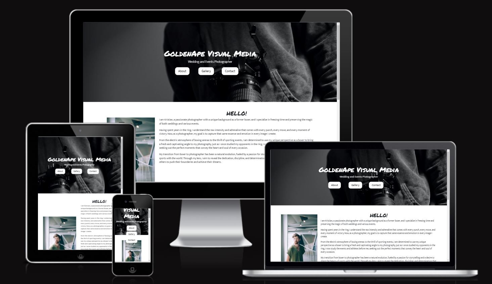

##Contents

- [UX](#UX)
  - [Site Purpose](#site-purpose "Site Purpose")
  - [Site Goal](#site-goal "Site Goal")
  - [Audience](#audience "Audience")
  - [Communication](#communication "Communication")
  - [Existing User Aims](#existing-user-aims "Existing User Aims")
  - [New User Aims](#new-user-aims "New User Aims")
- [Design](#design "Design")
  - [Colour scheme](#colour-scheme "Colour Scheme")
  - [Typography](#typography "Typography")
  - [Imagery](#imagery "Imagery")
- [Site Features](#site-features "Site Features")
  - [Existing features](#existing-features "Existing Features")
  - [Future features](#future-features "Future Features")
- [Testing](#testing "Testing")
- [Validating](#validating "Validating")
- [Technlogies used](#technologies-used "Technologies Used")
  - [Main languages](#main-languages "Main Languages")
  - [Frameworks, Libraries & Programs](#frameworks-libraries-programs "Frameworks, Libraries & Programs")
- [Deployment](#deployment "Deployment")
- [Credits](#credits "Credits")
  - [Content](#content "Content")
  - [Media](#media "Media")

## User Experience UX

### Goal

The goal of the site is for a clear, intiuitive website that contains all relevant information for users about the photographer. The photographer's goal is to introduce themselves and showcase a portfolio of images. They would also like to provide a way for users to communicate with them to find out more information or book a service. 
Users should be able to view images easily and intuitively navigate the website to find out more about the photographer, view more images and contact them for more information. 

### Users

Users will be adults looking for a professional photographer to shoot their event. They will be interested in viewing a selection of the photographer's images and contacting the photographer for more information. They may also want to find out availability or how a booking is run. 

-- The design is minimilistic to make it clear how to navigate the site and to put emphasis on the images to allow the pictures to speak for themselves.

### New User Stories

A first time user of the site wants to be able to:
Easily and intuitively navigate the site
Find out what kind of photos the photographer takes
Browse an existing portfolio of images
View content on their social media
Contact the photographer with any personal questions they may have
Book a service

### Existing User Stories

An existing user wants to be able to:
Contact the photographer easily
View up to date images
Find links to social media accounts

## UX Scope Design

### Colour Scheme

The colour scheme of the site is greyscale in order to maintain a minimililstic feel to empahsise the images. There is a pop of gold to match the colours from the logo. Elements are contrasting with black and white to make them stand out.  

### Typography

The handwritten font Shadows Into Light was chosen to provide a more personal feel. It was used on the site/business name 'Golden Ape Visual Media' and in the about me greeting and thank you as they make the about me message and business name more personal.

Mukta was chosen for the rest of the site as it is a clean sans-serif font which reads cleanly and fits in with the clean site look.

### Imagery

All imagery used on the webiste is from a stock webiste which is referenced in the credits section. Images were chosen to give a pop of colour against the greyscale theme of the website. There is one black and white image so maintain some consistency in colour. 

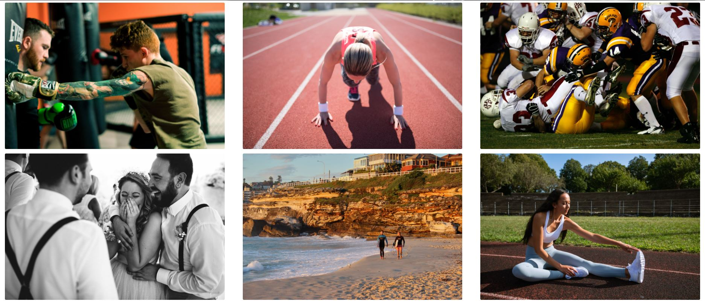

### Existing Features

#### Navigation Bar
This is the same across all pages for consistency. It conatins links to 'About', 'Gallery' and 'Contact Me' so the pages are quick and easy to find. The logo is also linked to the 'About' (home) page. Every page is linked so there is no need to use the browser back button. 

There is a toggle button for small screens as the whole bar doesn't fit across the top. This is inuitive to use as it appears on many sites.

The buttons are animated so that when you hover over them there is a slow contrasting colour change. 

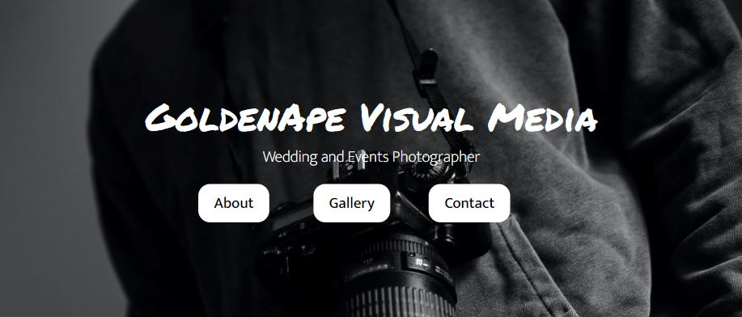
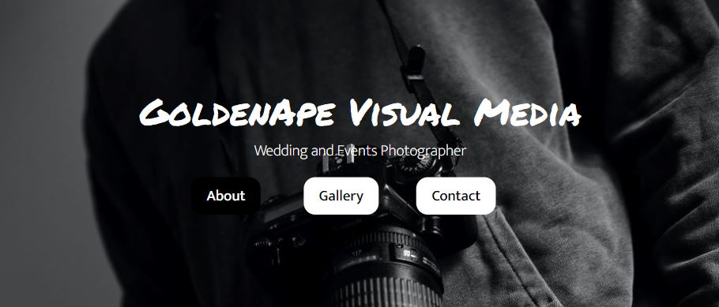

### Hero Image

Beneath the navigation bar there is a hero image, which is the same across all main pages for consistency. 

The hero image doesn't show on the 404 page as it took away from the 404 error message, and the main aim of this page is to display the error and direct them back to an existing page. It also doesn't appear on the thank you page as a form has already been submitted so the enquire button isn't important at this point. 

The hero image contains information on the type of photographer, which is main information people will look for when they acess the site. It also features an enquiry button so grab attention and cause more users to click it to fill in the contact form. 

#### About page  

The landing page is made up of an about me section, made up of text and an image. 

The text wraps around the image and this is responsive to all screen sizes. Small screen sizes would only have a very thin column of text next to the image, so this was changed so the image appears above the text to make it mroe readable. 

There is an animated carousel that showcases a small selection of images so people can see some of the portfolio while reading the about me section without having to visit the gallery page. This should make them want to click on the gallery page to view more. 

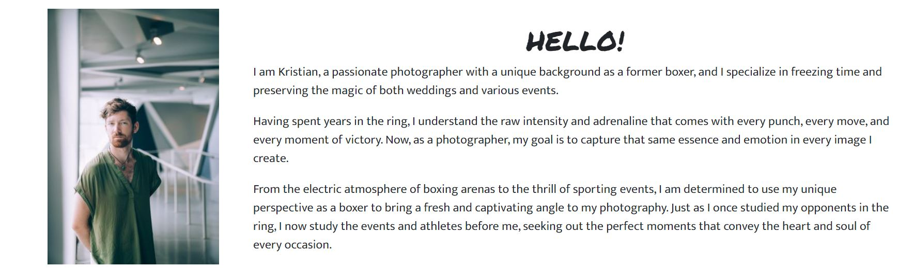
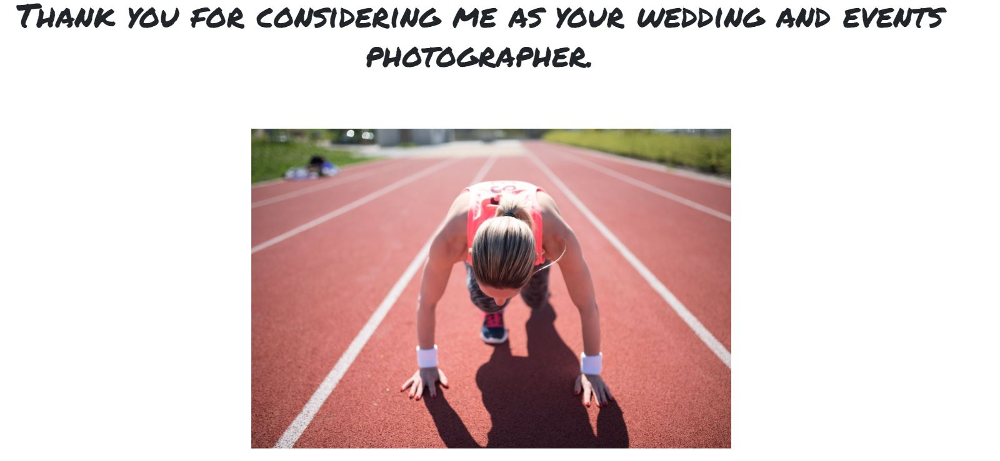
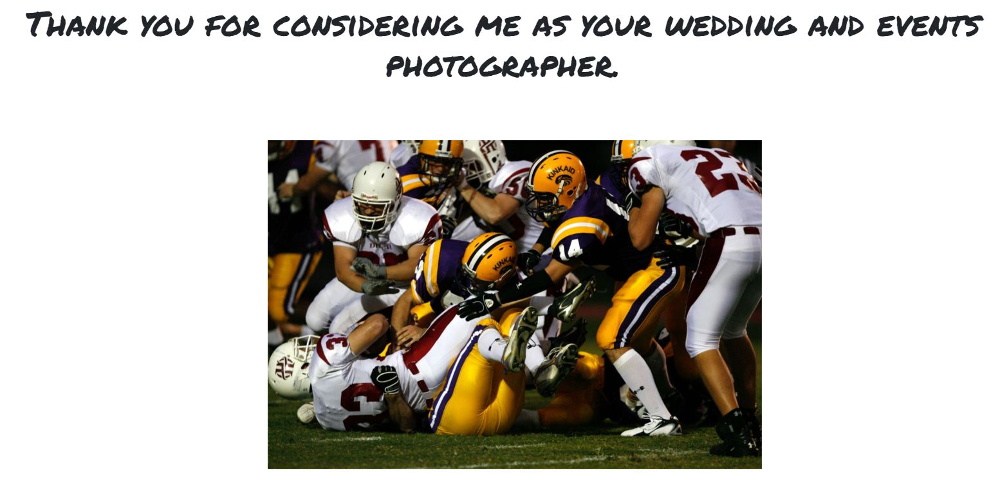

#### Footer

The footer contains the business name, additional contact information and social media links.

The background is a light gold to separate it from the body so that it subtly stands out. 

The social media links are coloured slightly darker to show they are links and are animated to change colour when the mouse hovers over or they are clicked. 

It is responsive and the columns stack for a smaller screen size as they don't fit across the page.

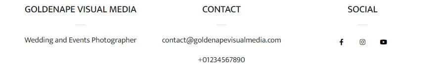
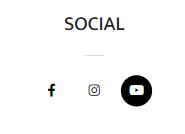

#### Gallery Page

The gallery page consists of 6 thumbnail images.

The thumbnails are responsive to different page sizes so they are never too small. They stack in a small screen, and as it gets bigger are in rows of 2 or 3 across.

When an image is clicked, it will appear larger in a modal. This is particularly useful for the larger screen sizes where it makes a large difference to the image size.


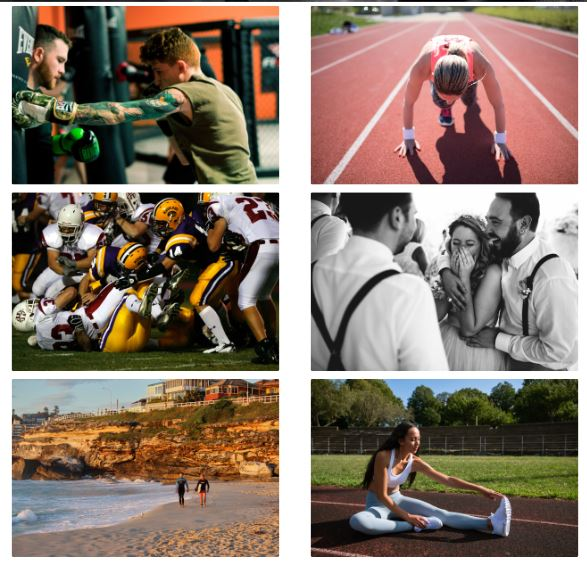

#### Contact Page

This page contains a simple contact form. 

The first input field is autofocused when loaded so the contact form is loaded straight into view and users can start filling it out without clicking with their mouse. 

Selected input have a box shadow so it is clear when an input is selected. This is particularly useful if a user is using the tab key to navigate the form.

The borders for required inputs are red when they contain invalid information to provide a visual way of showing they need completing.

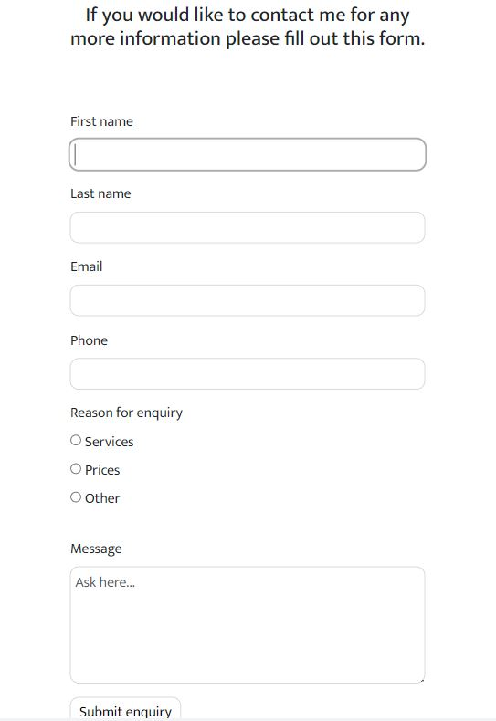

### Thank You Page

### 404 Page

### Future Features

- A map to show the location once they are running out of a studio. 
- A booking form so people can select a service and book in an available time from a published calendar. 
- Clicking on a gallery image makes it larger to take up the full viewport. 


## Testing 

Throughout development I used Chrome Dev Tools to check responsivity of all the elements. 

Every time I added a background overlay to the header image it covered the buttons too. If I changed the brightness of the image it also changed the brightness of the buttons. I could not find a workaround so in the end I removed the overlay and used contrasting white text and buttons on a dark image. 

The profile image took a lot of work. To start with it was cropped but I wanted the full image. To fix it I found the code
```
object-fit: scale-down;
```
on W3schools.

I then couldn't get the image into the right place. With a lot of trial and error, I managed to fix it by changing the height and the width of the image form px to % with the code
```
width: 100%;
height: 55vh;
```

Once I had made the image responsive for a small screen, it was off-center and I finally managed to fix it by adding the code
```
display: block;
```

As I used a textarea from Bootstrap with a responsive number of columns, the input was a different style to the rest of the form. I found the CSS used to style inputs on and finally changed the border radius, border and box shadow so they all matched.

Once deployed Bootstrap, css stylesheets and images were not linked correctly. After some searching, I hadn't included all of the correct Bootstrap links and I changed some of my link paths to link the css and images correctly. The header image still wouldn't show up no matter how many different file paths I did, but it turned out because I had replaced my file with a smaller file but kept the name, I needed to retype out the file again. I found this out by changing it to a different picture and then changing it back again. 


## Validating

- All files pass through the [W3 Validator](https://validator.w3.org/) with no issues found. 


- The site opens in Chrome, Firefox and Safari. 

- All links open to internal and external pages correctly. 

- It has a great Lighthouse performance and accessibility rating. 


## Technologies Used 

### Main Languages

HTML5 and CSS3 used. 

### Frameworks, Libraries & Programs

- Balsamiq cloud to design frameworks of the pages before development. 
- Google fonts for the fonts.
- Font Awesome for social media icons.
- Bootstrap v5.3 for the responsive grid layout and carousel. 
- Visual Studio Code to write code. 
- GitHub Desktop to store repository and allow me to code using VS code. 
- GitHub to store repository online. 

## Deployment

The site was deployed to GitHub pages. To do this the steps followed were:
- In the GitHub repository, go to Settings
- From the source section drop-down menu, select the Master Branch
- The live link can be found [HERE](https://sarah2244-4.github.io/Project-1-goldenapevisualmedia/)

## Credits

### Content

[W3 Schools](https://www.w3schools.com/css/css3_object-fit.asp) and [Digital Ocean](https://www.digitalocean.com/community/tutorials/css-cropping-images-object-fit) helped me fix the profile image sizing. 

(https://www.w3schools.com/css/css_form.asp) and (https://blog.logrocket.com/how-to-style-forms-with-css-a-beginners-guide/) helped me style the form. 

### Media

- The header image came from [Unsplash](https://unsplash.com/)
- [Camera by Miss Zhang](https://unsplash.com/photos/jz0xIgcwyL0)

- All other images came from [ISO Republic](https://isorepublic.com/)
- [Boxer punching punch bag by Hermes Rivera](https://isorepublic.com/photo/boxing-training/)
- [Runner starting a race by Shotstash](https://isorepublic.com/photo/woman-ready-to-run/)
- [American football by Keith Johnston](https://isorepublic.com/photo/american-football-game/)
- [Married couple laughing by Tom Pumford](https://isorepublic.com/photo/wedding-celebrations/)
- [Surfers walking on beach by Wyncliffe](https://isorepublic.com/photo/water-sand-surfboard/)
- [Runner stretching by Matt Moloney](https://isorepublic.com/photo/female-fitness-trainer/)
