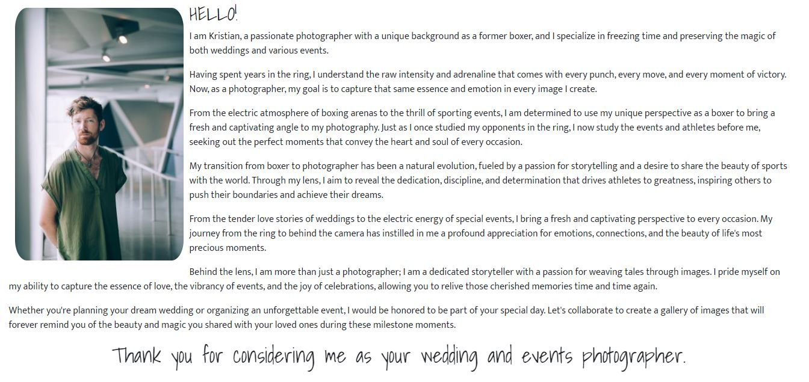
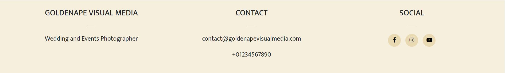

# GoldenApe Visual Media

GoldenApe Visual Media is a photographer portfolio inspired by a friend who is beginning a sports and wedding photography business. The target audience is women and men over the age of 18 who are either getting married or are athletes and want simple photos that stand out and tell a story.

The intent of the website is to showcase the photographer's work and provide an easy way to contact them.

The site is live, the link to this is found [HERE](https://sarah2244-4.github.io/Project-1-goldenapevisualmedia/).


##Contents

- [UX](#UX)
  - [Site Purpose](#site-purpose "Site Purpose")
  - [Site Goal](#site-goal "Site Goal")
  - [Audience](#audience "Audience")
  - [Communication](#communication "Communication")
  - [Existing User Aims](#existing-user-aims "Existing User Aims")
  - [New User Aims](#new-user-aims "New User Aims")
- [Design](#design "Design")
  - [Colour scheme](#colour-scheme "Colour Scheme")
  - [Typography](#typography "Typography")
  - [Imagery](#imagery "Imagery")
- [Site Features](#site-features "Site Features")
  - [Existing features](#existing-features "Existing Features")
  - [Future features](#future-features "Future Features")
- [Testing](#testing "Testing")
- [Validating](#validating "Validating")
- [Technlogies used](#technologies-used "Technologies Used")
  - [Main languages](#main-languages "Main Languages")
  - [Frameworks, Libraries & Programs](#frameworks-libraries-programs "Frameworks, Libraries & Programs")
- [Deployment](#deployment "Deployment")
- [Credits](#credits "Credits")
  - [Content](#content "Content")
  - [Media](#media "Media")

## UX

### Site Purpose

The site is designed to show information about the photographer, their images and a way to contact them. The photographer is a beginner so the site has minimal content to showcase what they have currently done.

### Site Goal

The two goals of the site is to showcase their portfolio including most recent images as the photographer gains more experience with links to social media for more work. It should also provide a clear way to contact the photographer.

### Audience

Primarily male athletes aged 16-40, looking to expand to and men and women who want to get married. They are looking for professional photos that showcase action shots and the atmosphere.

### Communication

The design is minimilistic to make it clear how to navigate the site and to put emphasis on the images to allow the pictures to speak for themselves.

### Existing User Aims

To contact to book in a servce, and view up to date images.

### New User Aims

To navigate the website quickly and easily, find out more about the photographer and view their portfolio. To eventually contact the photographer and book a service.

## Design

### Colour Scheme

The colour scheme is greyscale in order to maintain a minimililstic feel to empahsise the images. The hero image is also in black and white as this is part of the site design rather than an image to showcase. Elements are contrasting with black and white to make them stand out.  

### Typography

Permanent marker was used as it gives the sense of being handwritten. It was used on the site/business name 'GoldenApe Visual Media' and in the about me greeting and thank you as they make the about me message and business name more personal.
Mukta was chosen for the rest of the site as it is a clean sans-serif font which reads cleanly and fits in with the clean site look.

### Imagery

All imagery used on the webiste is from a stock webiste which is referenced in the credits section. Images were chosen to give a pop of colour against the greyscale theme of the website. There is one black and white image so maintain some consistency in colour. 


## Site Features

### Existing Features

#### Header
This is the same across all 3 pages for consistency. It conatins links to 'About', 'Gallery' and 'Contact' so the pages are quick and easy to find. The buttons are animated so when you hover over them there is a slow contrasting colour change. 


#### Landing Page 

The landing page is made up of an about me section, made up of text and an image. This has been made responsive so the image doesn't interfere with the paragraph text below it when resizing. 

There is an animated carousel that showcases a small selection of images so people can see some of the portfolio without having to visit the gallery page. This should make them want to click on the gallery page to view more. 




#### Gallery Page

The gallery page consists of 6 thumbnail images, which are responsive to different page sizes so they are never too small. 


#### Contact Page

This page consists of a simple contact form. Input fields have rounded corners like the header buttons to maintain site consistency. The first input field is selected when loaded so users can start filling it out without clicking with their mouse. It is also clear when an input is selected by adding a box shadow. 


#### Footer

The footer has the business name, additional contact information, social media links that have the same colours as the buttons in the header to maintain site-wide consistency. Again, the footer is responsive and the columns stack for a small screen. 




### Future Features

- A map to show the location once they are running out of a studio. 
- A booking form so people can select a service and book in an available time from a published calendar. 
- Clicking on a gallery image makes it larger to take up the full viewport. 


## Testing 

Throughout development I used Chrome Dev Tools to check responsivity of all the elements. 

Every time I added a background overlay to the header image it covered the buttons too. If I changed the brightness of the image it also changed the brightness of the buttons. I could not find a workaround so in the end I removed the overlay and used contrasting white text and buttons on a dark image. 

The profile image took a lot of work. To start with it was cropped but I wanted the full image. To fix it I found the code
```
object-fit: scale-down;
```
on W3schools.

I then couldn't get the image into the right place. With a lot of trial and error, I managed to fix it by changing the height and the width of the image form px to % with the code
```
width: 100%;
height: 55vh;
```

Once I had made the image responsive for a small screen, it was off-center and I finally managed to fix it by adding the code
```
display: block;
```

As I used a textarea from Bootstrap with a responsive number of columns, the input was a different style to the rest of the form. I found the CSS used to style inputs on and finally changed the border radius, border and box shadow so they all matched.

Once deployed Bootstrap, css stylesheets and images were not linked correctly. After some searching, I hadn't included all of the correct Bootstrap links and I changed some of my link paths to link the css and images correctly. The header image still wouldn't show up no matter how many different file paths I did, but it turned out because I had replaced my file with a smaller file but kept the name, I needed to retype out the file again. I found this out by changing it to a different picture and then changing it back again. 


## Validating

- All files pass through the [W3 Validator](https://validator.w3.org/) with no issues found. 


- The site opens in Chrome, Firefox and Safari. 

- All links open to internal and external pages correctly. 

- It has a great Lighthouse performance and accessibility rating. 


## Technologies Used 

### Main Languages

HTML5 and CSS3 used. 

### Frameworks, Libraries & Programs

- Balsamiq cloud to design frameworks of the pages before development. 
- Google fonts for the fonts.
- Font Awesome for social media icons.
- Bootstrap v5.3 for the responsive grid layout and carousel. 
- Visual Studio Code to write code. 
- GitHub Desktop to store repository and allow me to code using VS code. 
- GitHub to store repository online. 

## Deployment

The site was deployed to GitHub pages. To do this the steps followed were:
- In the GitHub repository, go to Settings
- From the source section drop-down menu, select the Master Branch
- The live link can be found [HERE](https://sarah2244-4.github.io/Project-1-goldenapevisualmedia/)

## Credits

### Content

[W3 Schools](https://www.w3schools.com/css/css3_object-fit.asp) and [Digital Ocean](https://www.digitalocean.com/community/tutorials/css-cropping-images-object-fit) helped me fix the profile image sizing. 

(https://www.w3schools.com/css/css_form.asp) and (https://blog.logrocket.com/how-to-style-forms-with-css-a-beginners-guide/) helped me style the form. 

### Media

- The header image came from [Unsplash](https://unsplash.com/)
- [Camera by Miss Zhang](https://unsplash.com/photos/jz0xIgcwyL0)

- All other images came from [ISO Republic](https://isorepublic.com/)
- [Boxer punching punch bag by Hermes Rivera](https://isorepublic.com/photo/boxing-training/)
- [Runner starting a race by Shotstash](https://isorepublic.com/photo/woman-ready-to-run/)
- [American football by Keith Johnston](https://isorepublic.com/photo/american-football-game/)
- [Married couple laughing by Tom Pumford](https://isorepublic.com/photo/wedding-celebrations/)
- [Surfers walking on beach by Wyncliffe](https://isorepublic.com/photo/water-sand-surfboard/)
- [Runner stretching by Matt Moloney](https://isorepublic.com/photo/female-fitness-trainer/)
