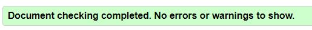
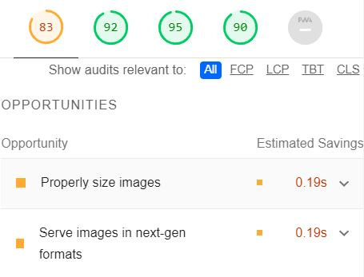
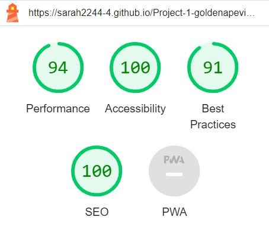
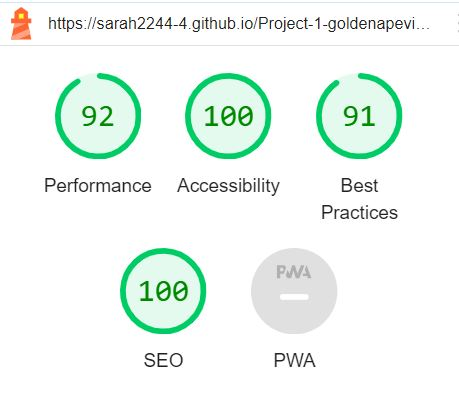
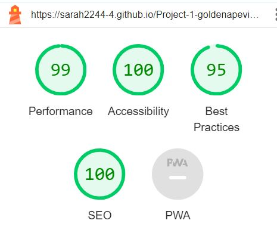

# Testing

## Contents

- [Responsivity](#responsivity) 
- [Browser Compatibility](#browser-compatibility) 
- [Manual Tests](#manual-tests) 
- [Testing User Stories](#testing-user-stories)
- [Bugs](#bugs)
- [Validating](#validating)
- [Lighthouse Testing](#lighthouse-testing)

## Responsivity 

Responsivity was testing using chrome developer tools. 

| Tests for all pages | iPhone SE | Pixel 5 | Samsung Galazy S8+ | iPad Air | Surface Pro 7 | Nest Hub | Desktop |
| --- | :---: | :---: | :---: | :---: | :---: | :---: | :---: | 
| Responsive | Yes | Yes | Yes | Yes | Yes | Yes | Yes |
| Navbar toggle button | Yes | Yes | Yes | N/A | N/A | N/A | N/A |
| Full Navbar | N/A | N/A | N/A | Yes | Yes | Yes | Yes |
| Hero text fits on screen | Yes | Yes | Yes | Yes | Yes | Yes | Yes |
| Links open correctly | Yes | Yes | Yes | Yes | Yes | Yes | Yes |
| Form does not submit with invalid information | Yes | Yes | Yes | Yes | Yes | Yes | Yes |
| Form submission works correctly | Yes | Yes | Yes | Yes | Yes | Yes | Yes |
| All images are seen | Yes | Yes | Yes | Yes | Yes | Yes | Yes |
| Good sizing of gallery images | Yes | Yes | Yes | Yes | Yes | Yes | Yes |
| Contact form autofocuses | Yes | Yes | Yes | Yes | Yes | Yes | Yes |
| All footer information appears on screen | Yes | Yes | Yes | Yes | Yes | Yes | Yes |

## Browser Compatibility

| Tests for all pages | Chrome | Firefox | Edge | Opera |
| --- | :---: | :---: | :---: | :---: |
| Loads as expected | Yes | Yes | Yes | Yes |
| Responsive | Yes | Yes | Yes | Yes |

## Manual Tests

| User Action | Expected response | Correct Response |
| --- | --- | :---: |
| CLick Logo | Navigates to index page | Yes | 
| Click Logo Text | Navigates to index page | Yes |
| Click About | Navigates to index (about) page | Yes |
| Click Gallery | Navigates to gallery page | Yes |
| Click Contact Me | Navigates to contact page | Yes |
| Click Contact Me | Page autofocuses on first input | Yes |
| Click NavBar Toggler | Navigation menu opens | Yes |
| Click NavBar Toggler Again | Navigation menu closes | No |
| Click Enquire | Navigates to contac page | Yes |
| Click Facebook Icon | Navigates to Facebook in new tab | Yes |
| Click Instagram Icon | Navigates to Instagram in new tab | Yes |
| Click YouTube Icon | Navigates to YouTube in new tab | Yes |
| Hover Over About | Font colour becomes gold | Yes |
| Hover Over Gallery | Font colour becomes gold | Yes |
| Hover Over Contact Me | Font colour becomes gold | Yes |
| Hover Over Facebook Icon | Circle becomes black and icon becomes white | Yes |
| Hover Over Instagram Icon | Circle becomes black and icon becomes white | Yes |
| Hover Over YouTube Icon | Circle becomes black and icon becomes white | Yes |
| Click an Image in the Gallery | Opens in a modal | Yes |
| Click Cross on Modal | Closes Modal | Yes |
| Click Screen Outside Modal | Closes Modal | Yes |
| Invalid Input in Contact Form | Box border is red | Yes |
| Valid Input in Contact Form | Box border is grey | Yes |
| Input is Focused | Box shadow is gold | Yes |
| Radio Button Selected | Fills in with grey colour | Yes |
| Click Submit enquiry with Invalid Inputs | Does not submit | Yes |
| Click Submit enquiry with Invalid First Name | Invalid message appears | No |
| Click Submit enquiry with Invalid First Name | Input box border is red | Yes |
| Click Submit enquiry with Invalid Last Name | Invalid message appears | Sometimes |
| Click Submit enquiry with Invalid Last Name | Input box border is red | Yes | 
| Click Submit enquiry with Invalid Email | Invalid message appears | Sometimes |
| Click Submit enquiry with Invalid Email | Input box border is red | Yes |
| Click Submit enquiry with Invalid Message | Invalid message appears | Yes |
| Click Submit enquiry with Invalid Message | Input box border is red | Yes | 
| Click Submit enquiry with Valid Inputs | Navigates to thank you page | Yes |
| Click Home on Thank You Page | Navigates to index page | Yes |
| Enter Non-Existent URL | Navigates to custom 404 page | Yes |
| Click Home on 404 Page | Navigates to index page | Yes |


## Testing User Stories

### New Users

| Goal | Result | Image |
| --- | --- | :---: |
| Easily and intuitively navigate the site | A navigation bar is fixed to the top of every page which provides links to all main pages. The toggle for small screens is familiar to use. Users never need to click the back button. | [navigation bar](assets/images/navigation-bar.JPG) [navigation for small screens](assets/images/navigation-bar-small-screens.JPG) |
| Find out what type of photographer they are | A large header on the hero image contrasts the dark background and tells users what service the photographer provides on the index page. Users can also read the about me section on the index page to find out more. | [hero image](assets/images/hero.JPG) [about me section]() |
| Browse an existing portfolio of images | A carousel is present on the index page so they can view a selection from the landing page. The gallery page provides a larger selection that can be viewed on a larger scale in a modal. | [carousel](assets/images/image-carousel.JPG) [gallery](assets/images/gallery-large-screen.JPG) [modal](assets/images/modal.JPG) |
| Navigate to the social media | The footer provides external links to the social media pages. Users will expect to find them here. The links open in new tabs so they don't lose the website. | [footer](assets/images/footer-gold.JPG) |
| Contact the photographer with questions or to book them | A contact form is provided that can be filled with any message. The footer also provides a contact phone number, email, and social media that could be used to contact the photographer. | [contact form](assets/images/contact-form.JPG) [contact details](assets/images/footer-gold.JPG) |

### Existing User Stories

| Goal | Result | Image |
| --- | --- | :---: |
| Contact the photographer with questions or to book them | A contact form is provided that can be filled with any message. The footer also provides a contact phone number, email, and social media that could be used to contact the photographer. | [contact form](assets/images/contact-form.JPG) [contact details](assets/images/footer-gold.JPG) |
| View up to date images | The gallery page shows the photographer's portfolio. | [gallery](assets/images/gallery-large-screen.JPG) |
| Find links to social media accounts | The footer provides external links to the social media pages. Users will expect to find them here. The links open in new tabs so they don't lose the website. | [footer](assets/images/footer-gold.JPG) |

## Bugs

### Resolved bugs

- Every time I added a background overlay to the header image it covered the buttons too. If I changed the brightness of the image it also changed the brightness of the buttons even though I did exactly the same as the example project. 
    
    I found the code 
    ```
    display: flex;
	align-items: center;
	justify-content: center;
	flex-direction: column;
    ```
    from [here](https://dzuz14.medium.com/code-a-full-width-hero-background-image-with-transparent-overlay-95d757f8ff2c) to turn the overlay into a flex object which didn't interfere with text on top of it. 

- I wanted the logo to be circular as it was designed for a circular profile image on facebook. As the image was a rectange rather than a square, the standard border radius didn't work. 

    My first choice was to crop the image and re-upload it as a square. 

    However, I came across code to center the rectangle into a circle 
    [here](https://www.webfx.com/blog/web-design/circular-images-css/) by adding the code
    ```
    overflow: hidden;
	top: 50%;
	transform: translateY(20%);
    ```

- Initially the profile image on the index page was in its own div and the text was in a separate div. This meant I could not get the text to wrap around it. 
    - I put image into the same div as the text and `float: left;` now works correctly.

- The submit button on the form would not load the thank you page. 
    - I changed the POST method to GET. 

### Unresolved Bugs

- When submitting an invalid form, the required messages don't always appear below the input fields that need completing. 
    - I couldn't find a fix without removing all formatting for the form. However, the message still comes up if the mouse hovers over the inputs and the page scrolls back up to the incompleted form suggesting there is an issue. 
    - I decided to also add red borders to invalid fields as a visual cue the inputs weren't complete. 
- The menu doesn't close on a mobile view when I test on my device. 
    - I copied the code that worked when I tried it on Bootstrap Docs directly into my site, but it didn't close on my site either. 
    - I removed all styling from my navbar and this didn't fix it either. 

## Validating

I used the [W3 Validator](https://validator.w3.org/) to validate my code. 

Initial issues were: 

- The 404 and thank you pages contained extra body tags. 
- The modals contained example aria-lablledby values that didn't match an existing ID as the modals did not have titles.

All pages have been run through the validator and all files pass. 



## Lighthouse Testing

### Initial Testing 



Initial testing found issues with:

- For performance images massively impacted load time. I then resized them and changed the image types to .WebP.
- The SEO had issues with a missing description in the head, which I added in. 
- Accessibility showed that ARIA IDs were not unique. I was unsure how to recifty this as it came from the Bootstrap navbar. 
- Also the footer headings had skipped heading order to h5 so I changed these to h2 and resized them in the style.css file. 

Once everything had been fixed I tested the pages with Lighthouse again. 

### Final Results of Testing

#### Index Page



#### Gallery Page



#### Contact Page



[Return back to README.md](README.md)